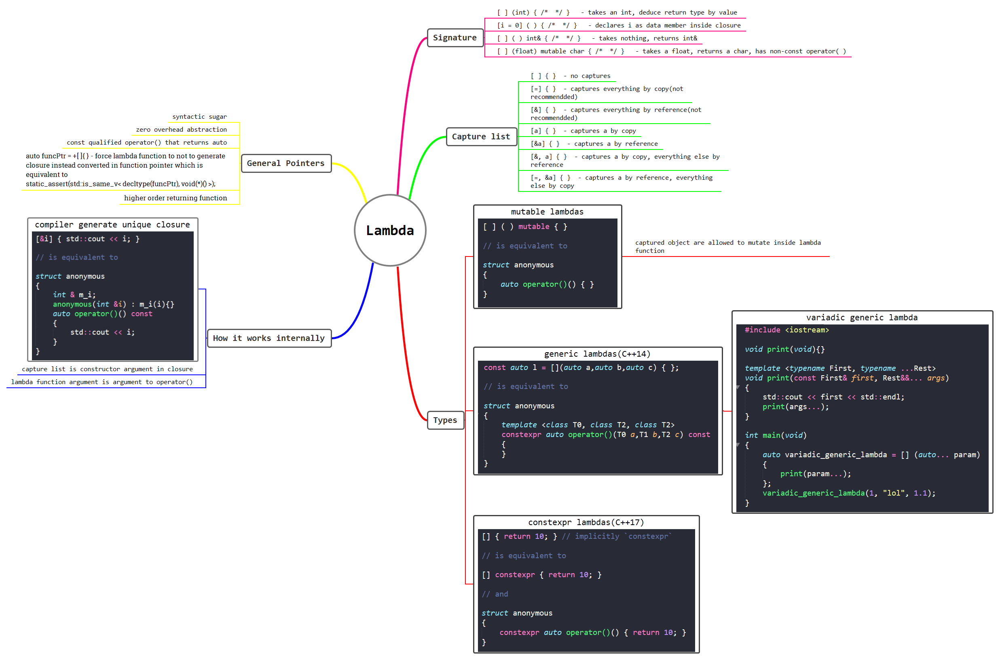

# links_cplusplus

## Mandatory

* [isocpp](https://isocpp.org)
  * [Core Guidelines](https://isocpp.github.io/CppCoreGuidelines/CppCoreGuidelines)
* [C++ compiler support](https://en.cppreference.com/w/cpp/compiler_support)
* [C++ Core Guidelines](https://isocpp.github.io/CppCoreGuidelines/CppCoreGuidelines#main)
* [GSL: Guidelines Support Library](https://github.com/Microsoft/GSL)

* [cppreference](cppreference.com)
* [Archives](https://en.cppreference.com/w/Cppreference:Archives)

* [gcc Flags recommendations](https://interrupt.memfault.com/blog/best-and-worst-gcc-clang-compiler-flags)
* [Range-Based For-Loops - pitfalls](https://open-std.org/jtc1/sc22/wg21/docs/papers/2014/n3853.htm)

## Online Compilers

* [godbolt](https://godbolt.org/)
* [cppinsights](https://cppinsights.io/)
* [wandbox](https://wandbox.org)

## Blogs/Communities

* [C++ Stories](https://www.cppstories.com)
  * [C++20 concepts](https://www.cppstories.com/2021/concepts-intro/)
  * [Polymorphic allocators](https://www.cppstories.com/2020/06/pmr-hacking.html/)

* [Bjarne Stroustrup](https://www.stroustrup.com)
  * [Glossary](https://www.stroustrup.com/glossary.html)

* [fluent{C++}](https://www.fluentcpp.com)
  * Daily C++
  * World map of STL algorithms
* [Refactoring Guru](https://refactoring.guru/): Tips and design patterns
* [C++ Weekly](https://www.youtube.com/watch?v=vLhr_y4YOIY) by Jason Turner

* [Modern Code](https://www.nosid.org): SWIFT, C++, Java (German only)
* [Random ASCII – tech blog of Bruce Dawson](https://randomascii.wordpress.com/)
* [C++ Weekly with Jason Turner](https://www.youtube.com/channel/UCxHAlbZQNFU2LgEtiqd2Maw) (youtube channel)
* [Microsoft C++ Team Blog](https://devblogs.microsoft.com/cppblog)
* [C++ FAQ](https://www.cs.technion.ac.il/users/yechiel/c++-faq/index.html)
* [reddit](https://www.reddit.com/r/cpp/)
* [Making C++ and the STL Work in the Linux / Windows Kernels](https://www.youtube.com/watch?v=uQSQy-7lveQ) Recording of CppCon 2016 talk by Rian Quinn ( [Abstract](https://cppcon2016.sched.com/event/7nL9/making-c-and-the-stl-work-in-the-linux-windows-kernels?iframe=no&w=700&sidebar=yes&bg=no) )
* [Vishal Chovatiya](http://www.vishalchovatiya.com/)
  * [Advance C++ Concepts & Idiom Examples You Should Know](http://www.vishalchovatiya.com/7-advance-cpp-concepts-idiom-examples-you-should-know/)
  * [Design patterns](http://www.vishalchovatiya.com/what-is-design-pattern/)
  * [Interface segregation](http://www.vishalchovatiya.com/interface-segregation-principle-in-cpp-solid-as-a-rock/)
  * [Liskov’s Substitution Principle](http://www.vishalchovatiya.com/liskovs-substitution-principle-in-cpp-solid-as-a-rock/)
  * ...
* [Usage of empty structs in C++](https://stackoverflow.com/questions/60685261/usage-of-empty-structs-in-c)
* [Book Review: “The Art of Readable Code” by Dustin Boswell and Trevor Foucher](https://embeddeduse.com/2022/01/14/book-review-the-art-of-readable-code-by-dustin-boswell-and-trevor-foucher/)

* [Vishal Chovatiya](https://www.vishalchovatiya.com/start-here/)
  - All About Lambda Function in C++, From C++11 to C++20: 

## Books/Guides/Papers

* [Effictive C++](https://www.aristeia.com/books.html) and other good stuff by Scott Meyers
* [cppbestpractices](https://lefticus.gitbooks.io/cpp-best-practices/content/)
* [Practical Guide to Bare Metal C++](https://alex-robenko.gitbook.io/bare_metal_cpp)
* [nextptr](https://www.nextptr.com/)
* [learn C++](https://www.learncpp.com/)
* [Thriving in a Crowded and Changing World: C++ 2006–2020](https://dl.acm.org/doi/pdf/10.1145/3386320)
* [C++ Templates with Virtual Functions?](https://rivermatrix.com/c-templates-with-virtual-functions/)
* [Modern C++ Design](https://en.wikipedia.org/wiki/Modern_C%2B%2B_Design#Policy-based_design) - explains *Policy-based design*
* [Writing Secure Code](https://www.goodreads.com/book/show/44916.Writing_Secure_Code) by  Michael Howard and David LeBlanc
* [Optimization](https://www.agner.org/optimize)
* [C++ Tutorial Home - 2020](https://www.bogotobogo.com/cplusplus/cpptut.php)

## Frameworks

* [POCO](https://pocoproject.org/)
* [EMB^2](https://embeddedartistry.com/blog/2018/08/20/emb2-a-c-c-framework-for-multi-core-and-multi-chip-embedded-systems/)
* [Embedded C++ Library](https://github.com/arobenko/embxx) (see *Practical Guide to Bare Metal C++*)
* [implot](https://github.com/epezent/implot)
* [imgui](https://github.com/ocornut/imgui/issues/2529)

## Fun stuff

* [C++ Mythbusting with Victor and Jason](https://www.youtube.com/watch?v=Bu1AEze14Ns): Victor And Jason Bust Some C++ Myths Live!
Comment: *I love seeing people with 10/20+ years experience still messing around and... messing up. It gives me hope that maybe some day, I too will mess up with such grace and so much knowledge in the back of my head :D I'm on much lower level and more in C, rather than C++ but I'll get there, with your help maybe sooner! :) Thanks for this videos, great guest, great topic, awesome channel :)*
* Scott Meyers [An Effective C++11/14 Sampler](https://www.bogotobogo.com/cplusplus/cpptut.php) - quite old but a nice and funny lecture on *std::move*, *std::forward* - I love Scots humor ;-)

* [Virtual Yosemite tour](https://www.virtualyosemite.org/virtual-tour/#node145) by Scot Highton
